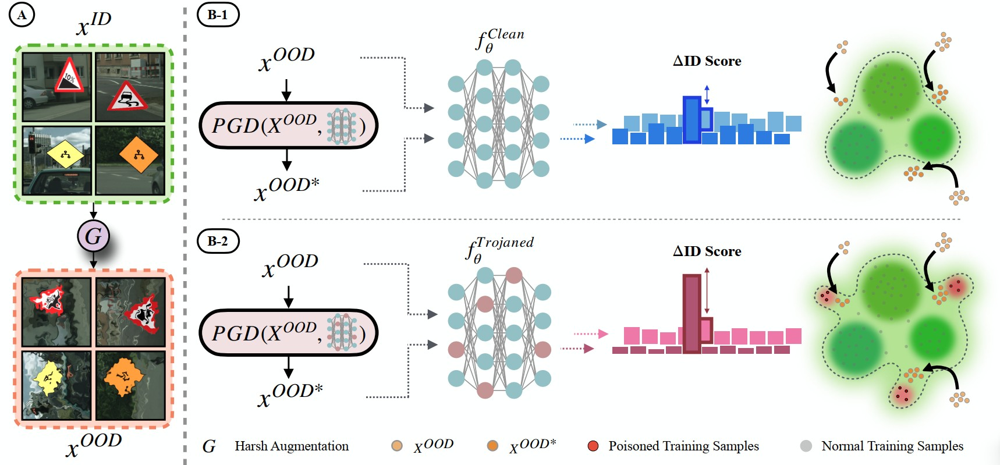

# Scanning Trojaned Models Using Out-of-Distribution Samples
Official PyTorch implementation of "Scanning Trojaned Models Using Out-of-Distribution Samples" (NeurIPS 2024) by [Hossein Mirzaei](https://scholar.google.com/citations?user=gISaPsoAAAAJ&hl=en), [Ali Ansari](https://scholar.google.com/citations?user=WYxYPXUAAAAJ)* , [Bahar Dibaei Nia](https://scholar.google.com/citations?hl=en&user=R3e5mekAAAAJ)*, [Mojtaba Nafez](https://scholar.google.com/citations?user=v0QfY20AAAAJ&hl=en), Moein Madadi, [Sepehr Rezaee](https://scholar.google.com/citations?hl=en&user=kYl9IWkAAAAJ), [Zeinab Sadat Taghavi](https://scholar.google.com/citations?hl=en&user=G9So2dEAAAAJ), Arad Maleki, Kian Shamsaie, Mahdi Hajialilue, [Jafar Habibi](https://scholar.google.com/citations?user=fKvyreEAAAAJ&hl=en), [Mohammad Sabokrou](https://scholar.google.com/citations?user=jqHXvT0AAAAJ&hl=en), [Mohammad Hossein Rohban](https://scholar.google.com/citations?user=pRyJ6FkAAAAJ&hl=en)

TRODO is a new trojan (backdoor) scanning method for deep neural networks that identifies "blind spots" where trojaned classifiers mistakenly classify out-of-distribution (OOD) samples as in-distribution (ID). By adversarially shifting OOD samples closer to ID, TRODO detects trojans without assumptions about the attack type and is effective even against adversarially trained trojans and in scenarios lacking training data, offering a versatile and accurate detection strategy.

<p align="center">

</p>

# Requirements

The current version requires the following python and CUDA versions:
- python 3.7+
- CUDA 11.1+

Additionally, the list of the packages used for this implementation is available in the `requirements.txt` file. To install them, use the following command:
```
pip install -r requirements.txt
```

# Usage

You can give a try on trodo by notebook [TRODO](TRODO.ipynb) [![][colab]][colab-trodo] which implements TRODO to detect trojans in models trained on CIFAR10 dataset. The label mappings are All2One and the models are not trained aversarially.

[colab]: <https://colab.research.google.com/assets/colab-badge.svg>
[colab-trodo]: <https://colab.research.google.com/github/rohban-lab/trodo/blob/main/TRODO.ipynb>

# Citation 
Please cite our work if you use the codebase: 
```
@inproceedings{
mirzaei2022scan,
title={Scanning Trojaned Models Using Out-of-Distribution Samples},
author={Hossein Mirzaei, Ali Ansari, Bahar Dibaei Nia, Mojtaba Nafez, Moein Madadi, Sepehr Rezaee, Zeinab Sadat Taghavi, Arad Maleki, Kian Shamsaie, Mahdi Hajialilue, Jafar Habibi, Mohammad Sabokrou, Mohammad Hossein Rohban},
booktitle={Advances in Neural Information Processing Systems},
year={2024},
url={https://neurips.cc/virtual/2024/poster/93781}
}
```
